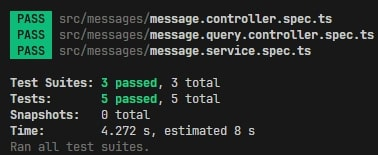

# Chat Service Tests

This file contains the automated test suite for one-to-one chat functionality.

## Test Types

### 1. Unit Tests
- `message.service.spec.ts` - MessageService unit tests
- `message.controller.spec.ts` - MessageController unit tests  
- `message.query.controller.spec.ts` - MessageQueryController unit tests

### 2. Integration Tests
- `chat.e2e-spec.ts` - End-to-end integration tests

## Running Tests

```bash
# Run unit tests
npm run test

# Run tests with coverage
npm run test:cov

# Run E2E tests
npm run test:e2e

# Run tests in watch mode
npm run test:watch
```

## Example Test Results


